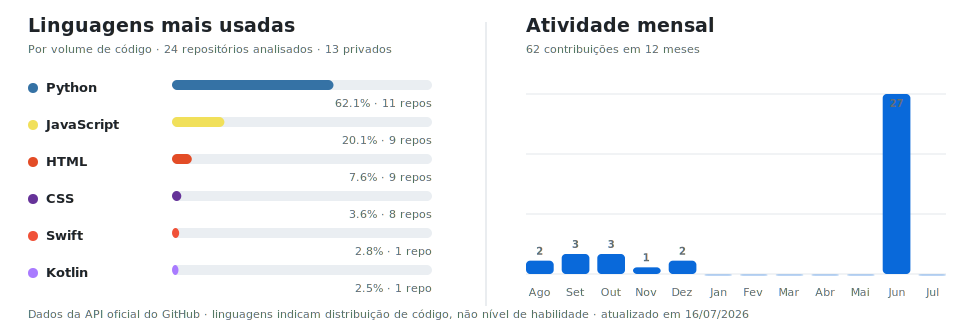

# Ailton Rodrigues

### Software Engineer | Python | Backend | Cloud Infrastructure

Construindo APIs, plataformas orientadas a dados e automações que conectam  
**software, inteligência artificial e infraestrutura**.

---

## Sobre mim

Sou **Engenheiro de Software** com foco em desenvolvimento backend utilizando
**Python**. Atuo na construção de APIs, pipelines de processamento de dados,
automações e aplicações executadas em ambientes de nuvem.

Minha experiência também passa pela infraestrutura necessária para colocar essas
soluções em produção: conteinerização, pipelines de entrega, observabilidade e
infraestrutura como código.

Atualmente, venho aprofundando meus conhecimentos em **arquiteturas distribuídas,
inteligência artificial e sistemas multiagentes**, buscando construir produtos
confiáveis, escaláveis e simples de operar.

## O que eu desenvolvo

| Área | Experiência |
|---|---|
| **Backend** | APIs REST, integrações, automações e serviços com Python |
| **Dados** | Processamento de dados, SQL, PostgreSQL e BigQuery |
| **Cloud** | Deploy e gerenciamento de aplicações na Google Cloud |
| **Infraestrutura** | Terraform, Docker, redes, serviços e ambientes |
| **Entrega** | CI/CD com GitHub Actions e GitLab CI |
| **Inteligência Artificial** | Agentes, RAG, automação e integração de modelos |

## Tecnologias

## Em destaque

### Open source e engenharia de plataforma

Tenho contribuído com o **Coolify**, investigando e desenvolvendo melhorias relacionadas
à integração com Docker, redes, experiência de gerenciamento e confiabilidade da plataforma.

[Ver contribuições no Coolify](https://github.com/coollabsio/coolify/pulls?q=is%3Apr+author%3Aailtonacr)

### Inteligência artificial e automação

Desenvolvo arquiteturas de agentes especializados, com orquestração, ferramentas,
respostas estruturadas e fluxos de validação. O objetivo é transformar modelos de IA
em sistemas previsíveis e integrados a produtos reais.

[Conhecer o projeto de agentes](https://github.com/ailtonacr/ai-agents)

## Código e atividade

<picture>
  <source media="(prefers-color-scheme: dark)" srcset="./assets/github-activity-dark.svg">
  <source media="(prefers-color-scheme: light)" srcset="./assets/github-activity-light.svg">
  
</picture>

---

[LinkedIn](https://www.linkedin.com/in/ailtonacr/) ·
[Repositórios](https://github.com/ailtonacr?tab=repositories)

